<p align="center">
  
</p>

[English](README.md) | [Dansk](README.da.md)

# ChromaPress

**Nuværende udgivelse:** `1.0.0a72`  
**Licens:** MIT  
**Platforme:** Windows 11 + WSL2 samt native Debian/Ubuntu  
**Runtime:** Python 3.11+ · PySide6 6.8+

ChromaPress er et native desktop-værktøj til analyse, staging, tilpasning, opbygning og verificering af Linux-installationsimages.

Den centrale designregel er enkel: **den valgte kilde-ISO behandles som skrivebeskyttet**. Ændringer stages og gennemgås separat og håndteres derefter af den Linux-native service-/buildmotor i et kontrolleret workspace.

> `1.0.0a72` er en alpha-udgivelse. Statisk analyse, manifests og pakkeevidens kan ikke erstatte reel boot-, installations-, live-session- eller hardwarevalidering, hvor dette er påkrævet.

## Højdepunkter

- Native PySide6/Qt-desktopinterface.
- Windows-front-end, der bruger WSL2 til Linux-native image-værktøjer.
- Native Linux-motor i Debian-pakken.
- Analyse af eksisterende ISO uden at kopiere eller ændre kilde-ISO'en.
- Rollebaseret programvalg og inspektion af programmer/komponenter i mål-imaget.
- Staged **Changes → Test → Undo**-workflow.
- Skrivebeskyttet Boot & Hardware-evidens, før ændringer stages.
- Bevaringsorienteret planlægning af System, Installer, Desktop og brugerdefineret indhold.
- Gennemgang af den aktuelle image-plan før produktion.
- SHA-256-baserede kilde- og integritetskontroller, hvor det er relevant.
- Valgfri AI App Studio med eksplicitte review- og valideringsgates; funktionen er ikke en del af den aktuelt verificerede runtime-sti.
- Dansk og engelsk interface.
- Windows `.exe`- og Debian `.deb`-release-builds.

## Verificeret ISO-build — end-to-end evidens

Skærmbillederne nedenfor dokumenterer ét komplet ChromaPress-buildforløb fra en gennemgået produktionsplan til en bootet live-ISO, hvor den ønskede pakkeændring blev verificeret ved runtime.

### 1. Gennemgået buildplan klar

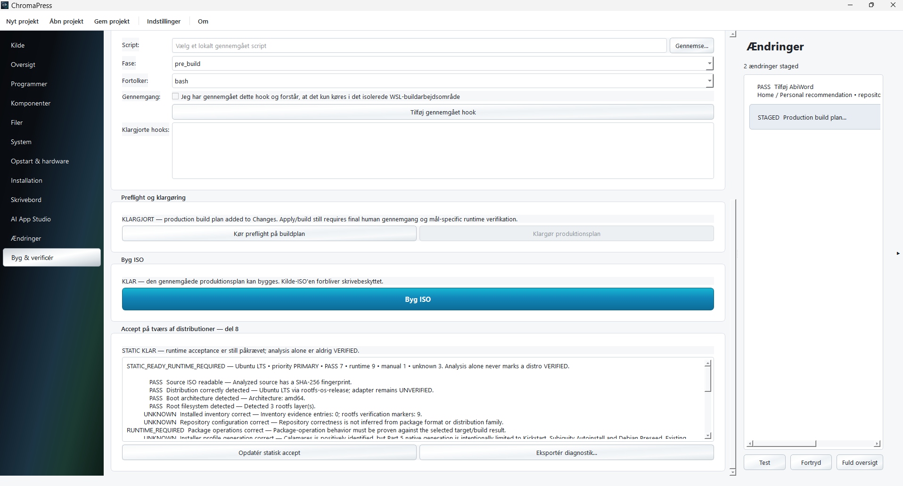

Produktionsplanen har bestået preflight og er staged til generering. Den valgte kilde-ISO forbliver skrivebeskyttet.

### 2. Generering af live-ISO

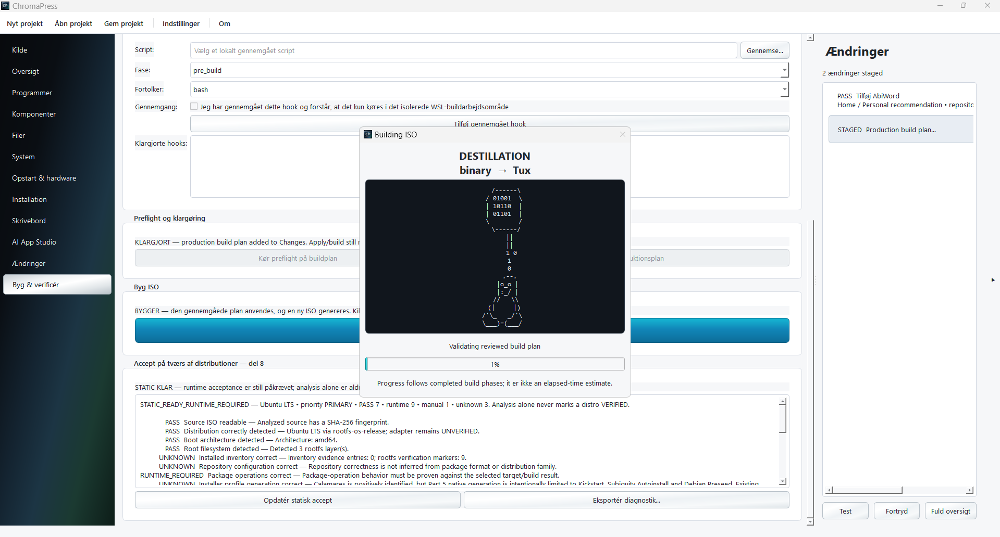

Under genereringen viser ChromaPress den aktuelle reelle buildfase og en monoton fremdriftsprocent. Procenten øges ud fra afsluttede buildfaser og ikke ud fra estimeret forløbet tid.

### 3. Build færdig

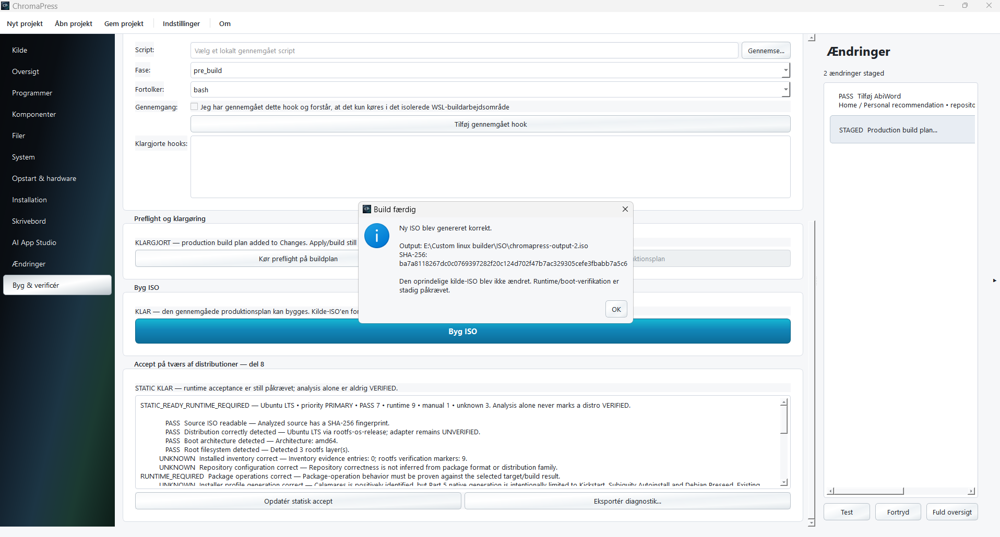

Den genererede ISO gennemførte ChromaPress' SHA-256-kontrol af output samt statiske kontroller af bootstrukturen. Runtime-bootverificering behandles fortsat som en separat gate.

### 4. Runtime-verificering

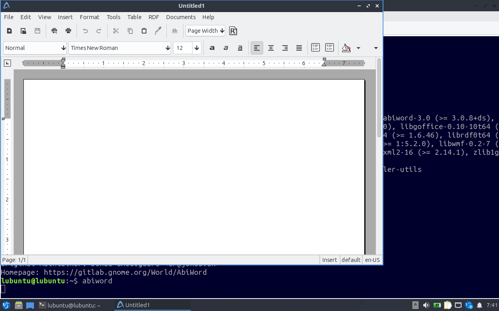

Den genererede ISO blev bootet som et Lubuntu 26.04 live-system i Oracle VirtualBox. Pakken, der blev tilføjet af ChromaPress, blev derefter verificeret som installeret og startet korrekt.

```text
BOOT_ISO=PASS
LIVE_DESKTOP=PASS
ABIWORD_INSTALLED=PASS
ABIWORD_VERSION=3.0.8+ds-2
ABIWORD_LAUNCH=PASS
```

### Beklager, Cubic. 🙂

ChromaPress eksisterer blandt andet på grund af den tid, der er brugt på at fejlfinde værktøjer til tilpasning af Linux-ISO'er.

En venlig påmindelse fra ét open source-projekt til et andet: mennesker, der bruger timer på at finde, reproducere og rette fejl, er også bidragydere. Behandl dem sådan.

<details>
<summary><strong>Komplet verificeringsforløb</strong></summary>

Den komplette testsekvens er bevaret nedenfor som yderligere evidens.

#### Oprettelse af VirtualBox-testmaskine

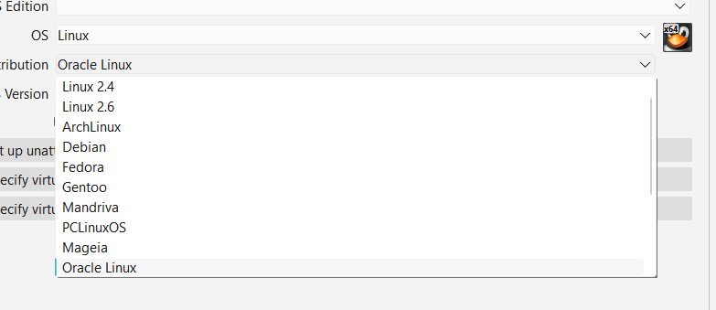

#### Indstillinger for VirtualBox-maskinen

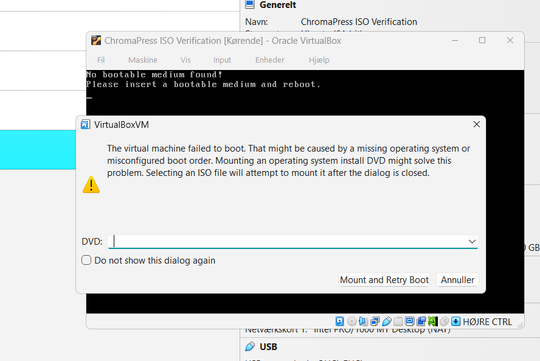

#### Kontrol af bootmedie

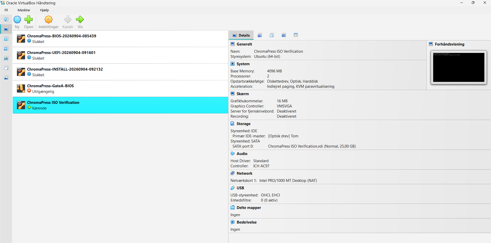

#### Genereret ISO monteret

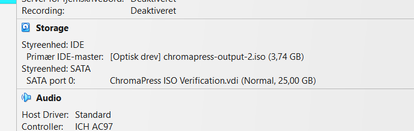

#### Lubuntu live-desktop nået


#### Skærmbillede fra live-session under test

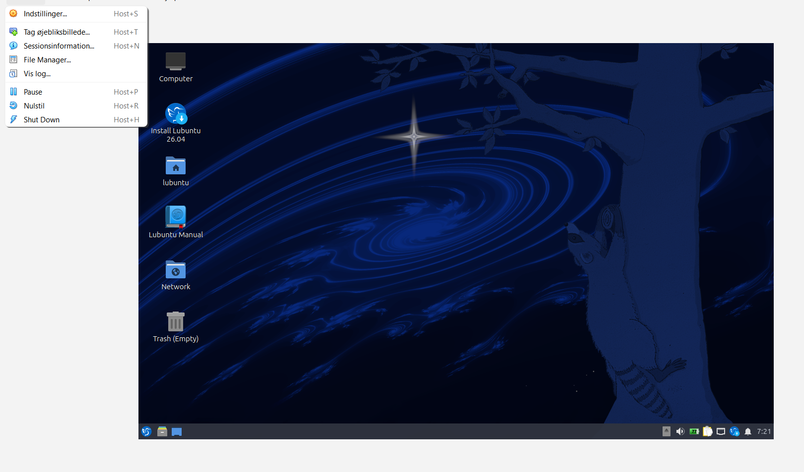

#### AbiWord synlig i live-systemets menu

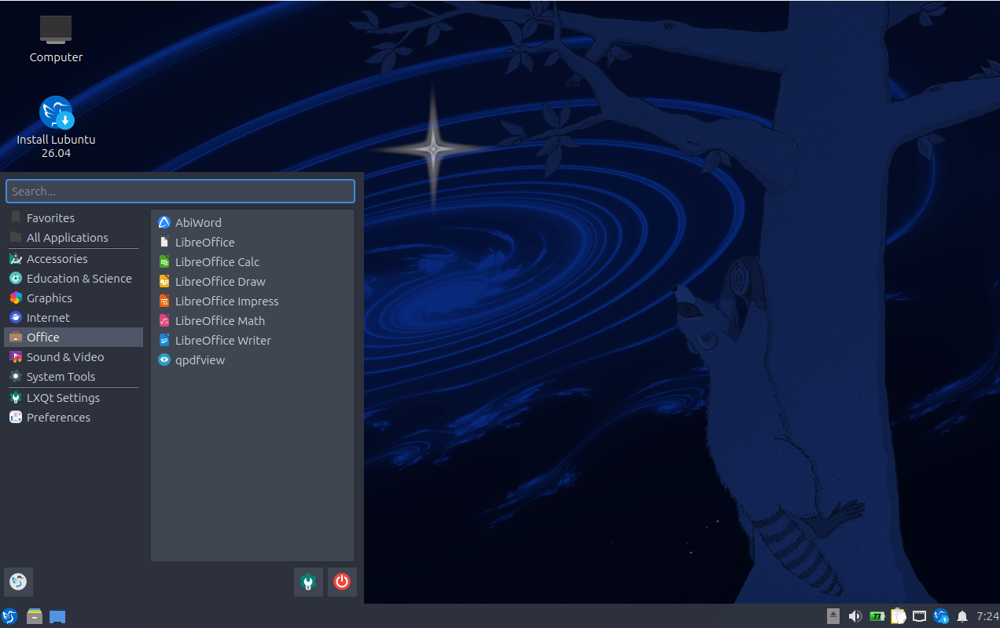

#### VirtualBox Shared Clipboard-kontrol under test

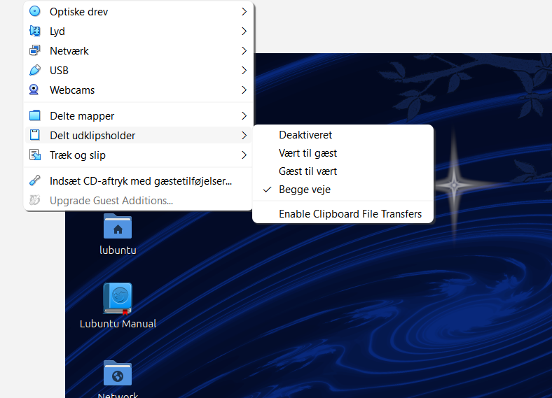

#### Pakkestatus verificeret

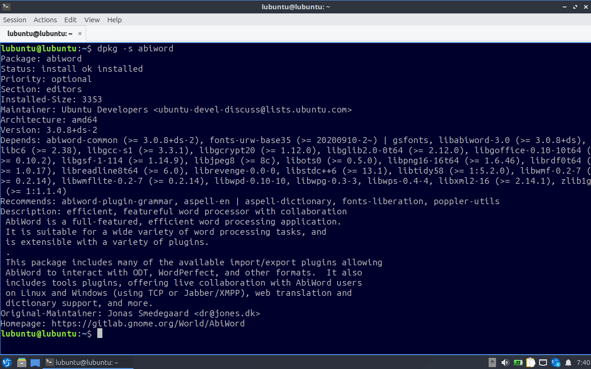

</details>

## Kilde-ISO og analyse

ChromaPress kan arbejde ud fra en understøttet distributionskilde eller åbne en eksisterende ISO direkte. Eksisterende images refereres på deres nuværende placering og analyseres gennem den Linux-native motor.

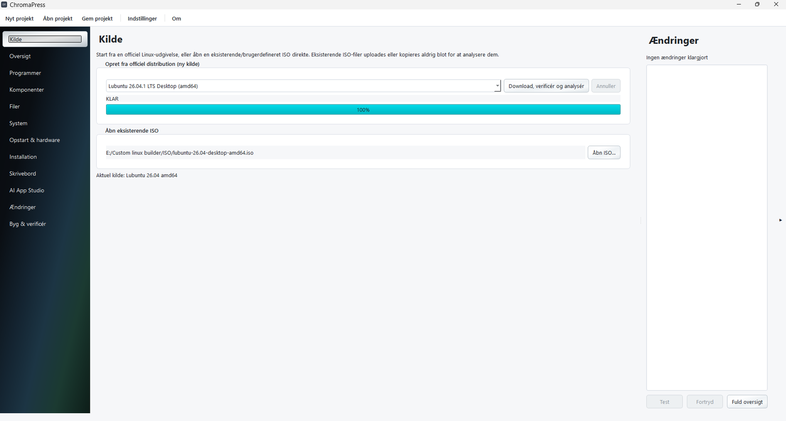

Overview-siden viser den registrerede distribution, arkitektur, boottilstand, root-filsystemlag, installer-evidens og kilde-SHA-256.

<details>
<summary><strong>Skærmbillede af ISO-overblik</strong></summary>

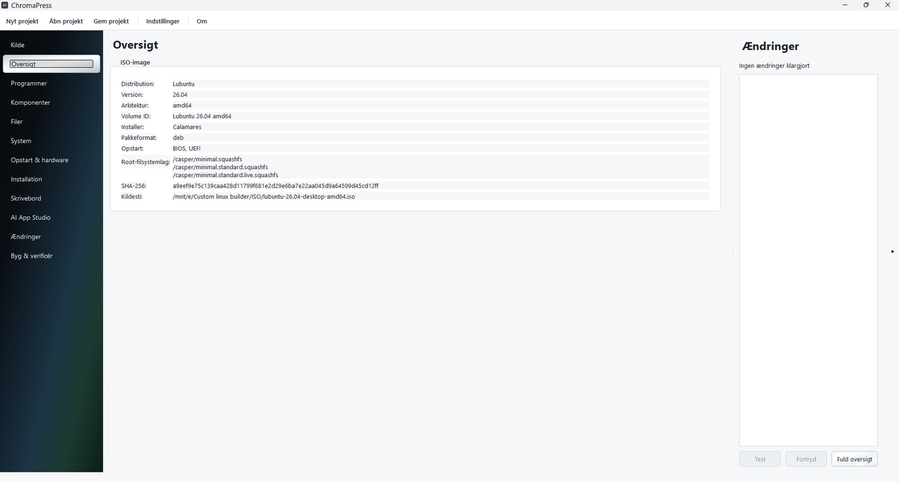

</details>

## Programvalg

ChromaPress kan organisere programmer ud fra det tilsigtede formål med målsystemet. Programændringer forbliver eksplicitte og staged i stedet for at blive anvendt automatisk.

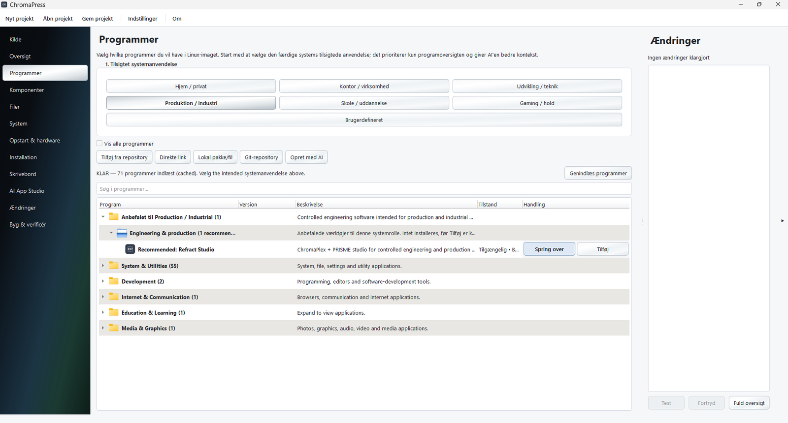

## AI App Studio

> **Verificeringsstatus:** AI App Studio er ikke runtime-testet i denne udgivelse og indgår ikke i den verificerede end-to-end release-sti, der er dokumenteret ovenfor.

AI App Studio er valgfrit og arbejder inden for samme reviewmodel som resten af ChromaPress.

Det kan hjælpe med at oprette eller revidere et program med kontekst om mål-Linux-systemet, samtidig med at det genererede projekt forbliver inspicerbart. Genereret kildekode **indsættes ikke ukritisk i en ISO**: review og validering er påkrævet, før programmet kan stages.

API-legitimationsoplysninger er sessionsbaserede og skrives ikke til ChromaPress-projektfiler eller kopieres til mål-imaget.

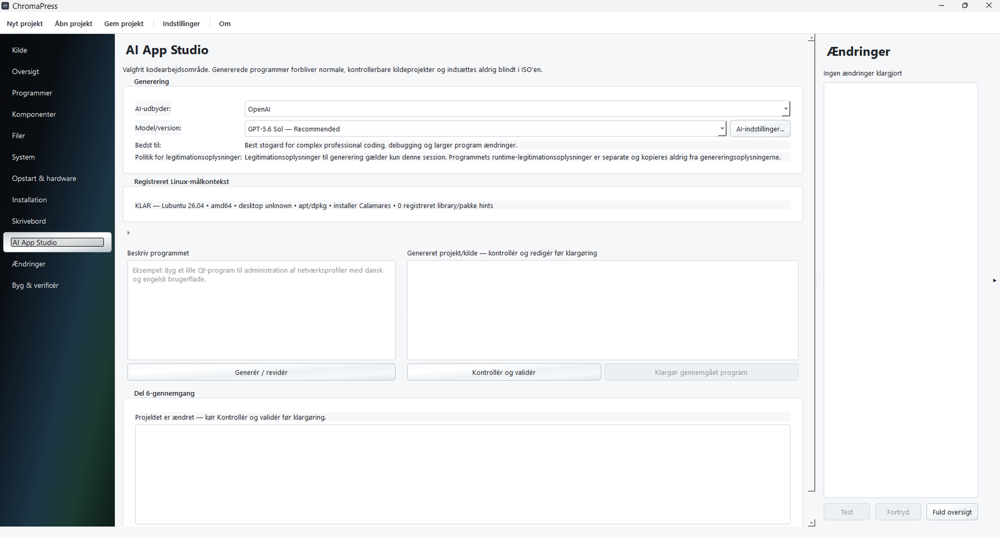

## Gennemgang før build

Den aktuelle image-plan giver ét samlet sted til at gennemgå den valgte kilde og den staged hensigt før produktion.

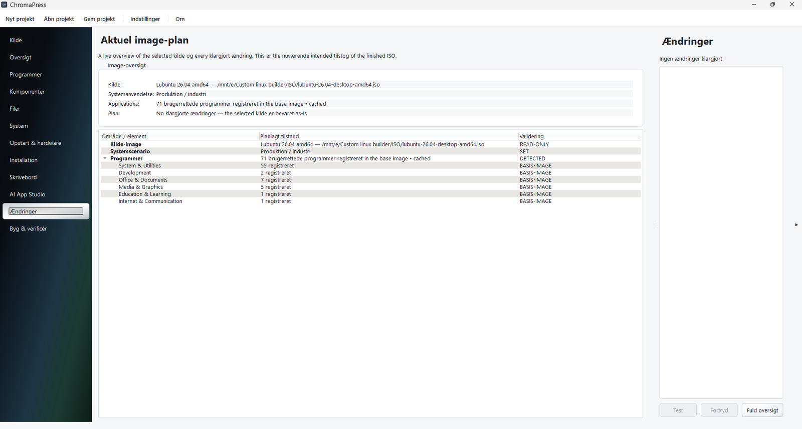

Produktionssiden samler genbrugelig profilhåndtering, outputkonfiguration, verificeringsindstillinger og gennemgåede expert hooks.

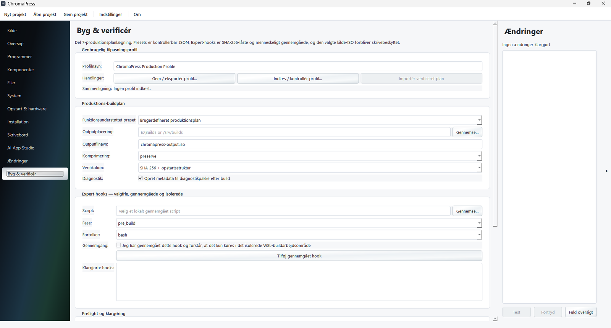

## Sikkerheds- og verificeringsmodel

ChromaPress er bevidst designet med fokus på bevaring og fail-closed-adfærd.

- Den valgte input-ISO ændres ikke på stedet.
- Ændringer stages, før de anvendes.
- Ukendte eller ikke-understøttede egenskaber i mål-imaget behandles ikke automatisk som verificerede.
- Værtsmaskinens Windows/WSL-tilstand bruges ikke som erstatning for manglende evidens fra mål-imaget.
- Sikkerhedsfølsom konfiguration er opdelt i eksplicitte gates.
- Adgangskoder, API-nøgler, signeringsnøgler og lignende hemmeligheder er ikke beregnet til at blive gemt i projektfiler.
- AI-genereret kode behandles som kildekode, der skal gennemgås, og betragtes ikke som troværdig alene, fordi AI har genereret den.
- Statisk evidens beviser ikke runtime-, hardware- eller deploymentadfærd.
- Endelig release-godkendelse kræver fortsat de relevante tests i den virkelige verden.

Se [SECURITY.md](SECURITY.md) for rapportering af sårbarheder og sikkerhedsforventninger.

## Flere skærmbilleder

<details>
<summary><strong>Filer og brugerdefineret indhold</strong></summary>

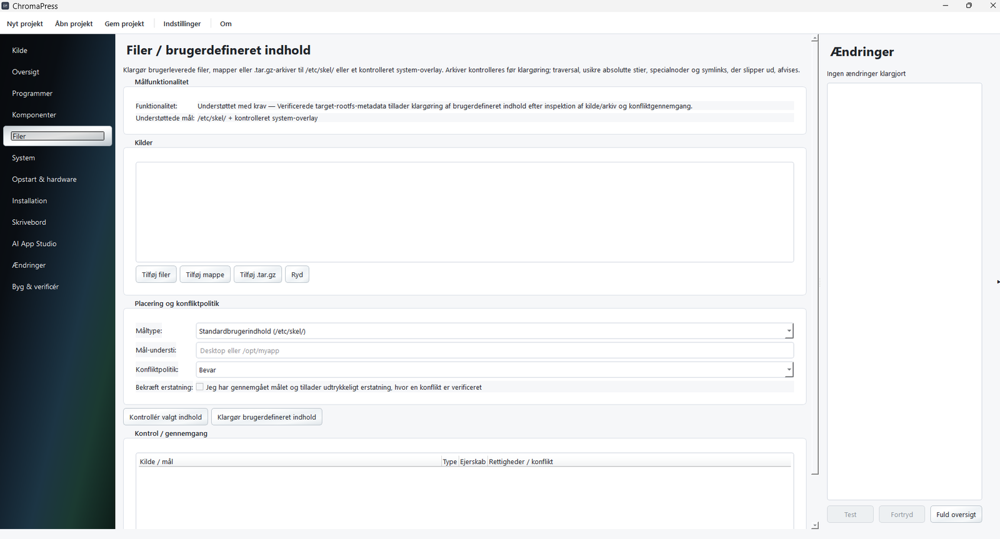

</details>

<details>
<summary><strong>Systemkonfiguration</strong></summary>

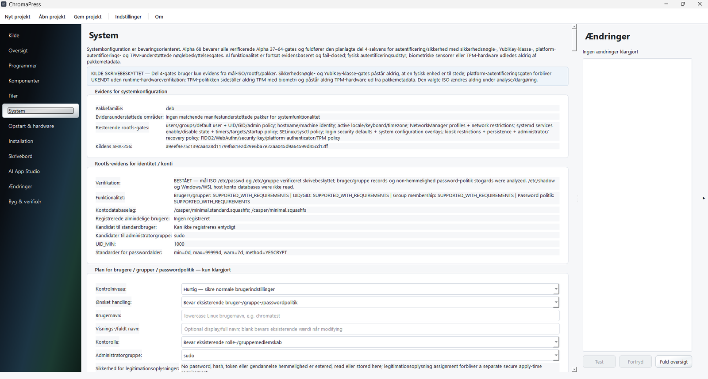

</details>

<details>
<summary><strong>Boot og hardware</strong></summary>

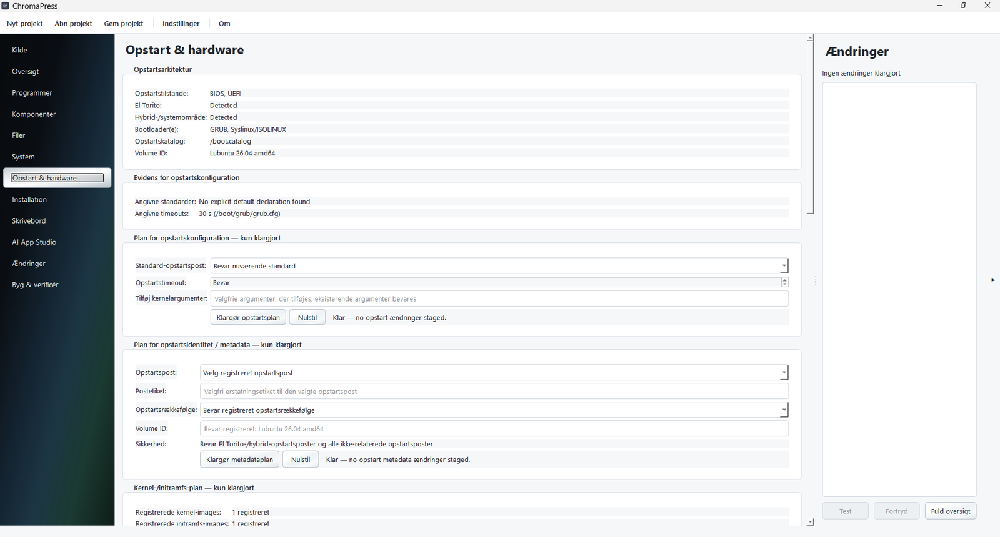

</details>

<details>
<summary><strong>Installer-konfiguration</strong></summary>

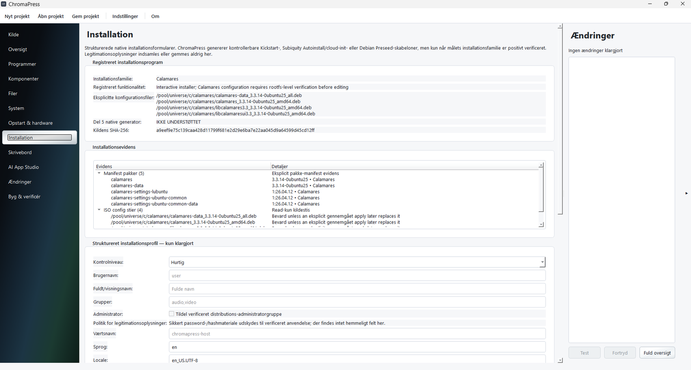

</details>

<details>
<summary><strong>Desktop-konfiguration</strong></summary>

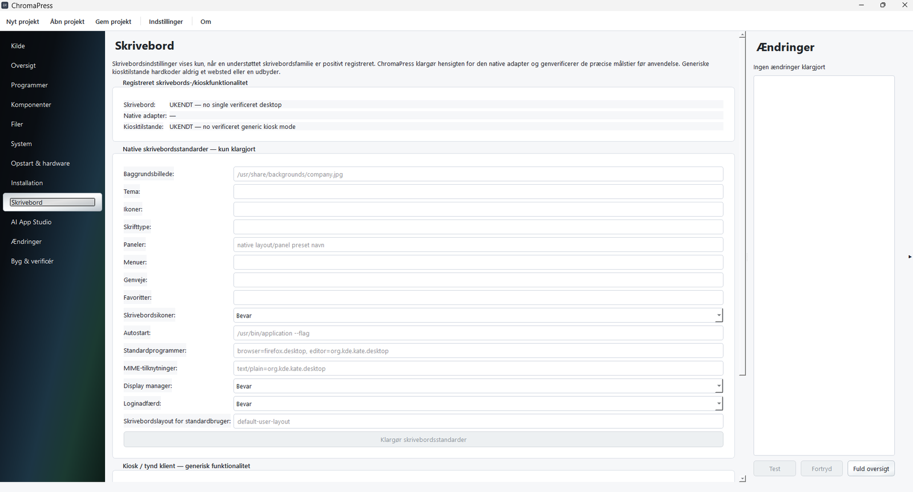

</details>

<details>
<summary><strong>Sprog- og AI-indstillinger</strong></summary>

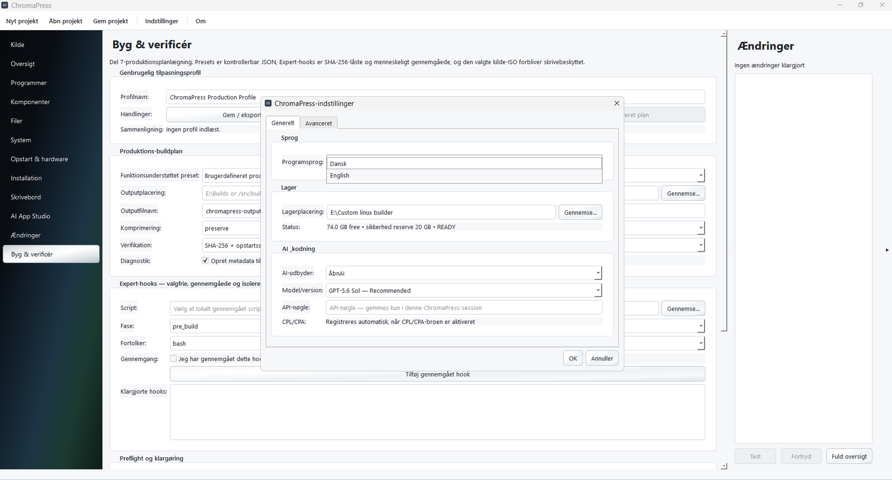

</details>

## Installation

### Windows

Release-buildet er en native Windows-GUI. Linux-native ISO-operationer delegeres til WSL2.

1. Installer/aktivér WSL2 og et understøttet Linux-miljø.
2. Download `ChromaPress.exe` fra GitHub Releases-siden.
3. Start ChromaPress normalt fra Windows.
4. Vælg eller åbn den Linux-ISO, du vil analysere.

Kilde-ISO'en forbliver refereret på sin nuværende placering; ChromaPress kræver ikke et uploadtrin.

### Debian / Ubuntu

Download `.deb`-releasefilen og installer den med din normale pakkehåndtering, for eksempel:

```bash
sudo apt install ./chromapress_1.0.0~a72-1_all.deb
```

Debian-pakken bruger Linux-motoren direkte i stedet for at gå gennem WSL.

### Fra kildekode

```bash
python -m venv .venv
python -m pip install -e .
python -m chromapress.app
```

På Windows oprettes det virtuelle miljø med din normale Windows-Python-installation, og WSL2 skal være tilgængelig til Linux-native image-operationer.

## Udvikling og tests

Den endelige release-regressionsgate kan køres med:

```bash
python -m pytest -q final_testpack/tests/test_final_release_gate.py
```

Windows release-build:

```powershell
.\packaging\build_windows_release.ps1 -SkipInstall
```

Debian release-build:

```bash
./packaging/build_deb.sh
```

Et vellykket build er ikke i sig selv en komplet release-godkendelse. De producerede artifacts skal også testes som de faktisk installerede/distribuerede programmer.

## Bygget med ChatGPT

ChromaPress blev skabt gennem et længerevarende menneske–AI-samarbejde mellem **Janus Rokkjær og ChatGPT**.

Programmets arkitektur, implementering, interfacearbejde, fejlfinding, test, lokalisering, dokumentation og releaseforberedelse blev udviklet med ChatGPT som den primære udviklingsassistent. Produktretning, krav, godkendelseskriterier og praktisk test blev styret af Janus Rokkjær gennem hele udviklingen.

I stedet for at skjule brugen af AI udgives ChromaPress åbent som et eksempel på, hvad der kan opnås, når AI-assisteret udvikling kombineres med løbende menneskelig gennemgang, test og korrektion.

ChatGPT og OpenAI er ikke tilknyttet ChromaPress og støtter eller godkender ikke projektet.

## Genereret output

Programmer og ISO-images, der oprettes med ChromaPress, er brugerens output. ChromaPress tilføjer ikke automatisk deployment-branding, telemetriidentifikatorer eller en fælles ChromaPress-runtime til programmer, der oprettes gennem AI App Studio.

## Roadmap

Den næste ChromaPress-udviklingscyklus er planlagt til at undersøge to større tilføjelser, efter at den første udgivelse har haft tid til reel brug og feedback.

### System Backup ISO

Opret en bootbar recovery-ISO fra en eksisterende Linux-installation, samtidig med at det oprindelige system bevares under indsamlingen.

Planlagte mål omfatter:

- sikker, skrivebeskyttet indsamling af systemet
- eksplicit gennemgang af include/exclude før capture
- SquashFS-baseret systemimage
- generering af bootbar recovery-ISO
- manifest- og SHA-256-integritetsverificering
- bevaringsorienteret håndtering af brugerindhold og brugerdefineret systemindhold

### Bootable USB Writer

Skriv en ChromaPress-genereret ISO direkte til et flytbart USB-medie.

Planlagte sikkerhedskrav omfatter:

- eksplicit valg af flytbar enhed
- ingen automatisk valg af den første disk
- system-/interne diske blokeret som standard
- bekræftelse før destruktiv skrivning
- skrive-, flush- og read-back-verificering
- afsluttende PASS/FAIL-evidens

Disse funktioner er planlagt til den næste udviklingsversion efter den første ChromaPress-udgivelse.

Forslag til implementering, platformspecifik erfaring og sikkerhedsanbefalinger er meget velkomne.

## Bidrag

Idéer, fejlrapporter, dokumentationsforbedringer og fokuserede kodebidrag er velkomne.

Læs [CONTRIBUTING.md](CONTRIBUTING.md), før du åbner en pull request. ChromaPress har strenge regler for bevaring og verificering omkring ISO-håndtering, staged ændringer, privilege boundaries og sikkerhedsfølsomme operationer, men bidragydere behøver ikke være eksperter i alle dele af projektet for at foreslå en idé eller forbedring.

## Udviklingshistorik

Den oprindelige alpha-for-alpha-udviklingshistorik er bevaret i [docs/DEVELOPMENT_HISTORY.md](docs/DEVELOPMENT_HISTORY.md).

En kortere releaseorienteret historik findes i [CHANGELOG.md](CHANGELOG.md).

## Licens

ChromaPress udgives under [MIT License](LICENSE).

Copyright © 2026 Janus Rokkjær.

Tredjepartskomponenter og notices er dokumenteret i [THIRD_PARTY_NOTICES.md](THIRD_PARTY_NOTICES.md).
